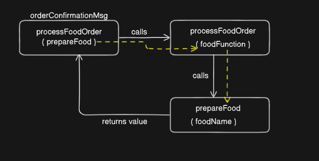

<!-- 
    1. Write a function named `processFoodOrder` that takes another function namely `prepareFood` as a parameter and calls it with an argument `"special hyderabadi chicken biryani"`.
    Return the result of calling `prepareFood`;
-->

 ```javascript

    function processFoodOrder (foodFunction){
        let foodName = "special hyderabadi chicken biryani";

        // returning a function from within a function
        return foodFunction(foodName);
    }

    function prepareFood(food){
        return `${food} is being prepared. Please wait for the order.`
    }

    // passing a function as an argument
    let orderConfirmationMessage = processFoodOrder(prepareFood);
    console.log(orderConfirmationMessage);

```



<!-- 
2. Write a function named `takeOrder` that returns another function. The returned function should take one parameter `orderType` and return a message like `making food name`.
Store the returned function in a variable named `orderConfirmation` and call it with `mysore masala dosa`.
 -->

 ```javascript
(1)

    function prepareOrder(foodName){
        return `making ${foodName}`;
    }

    function takeOrder(){
        return prepareOrder("mysore masala dosa");
    }

    let orderConfirmation = takeOrder();
    console.log(orderConfirmation);

        // making mysore masala dosa

(2)

    function takeOrder(orderName){
        return function orderConfirm(foodName) {
            return `order confirmed for ${foodName}`
        }
    }

    let orderConfirmationMessage = takeOrder();
    console.log(orderConfirmationMessage("mysore masala dosa"));

    // order confirmed for mysore masala dosa
 ```